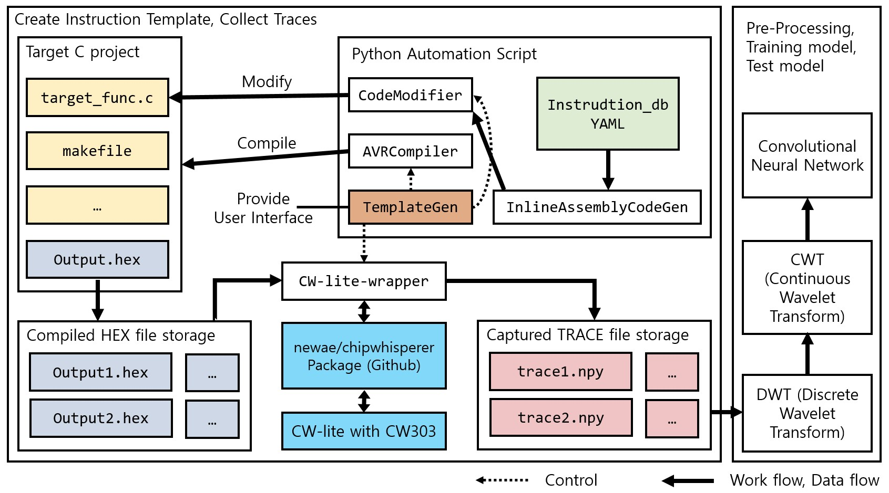

[View in korean](./kor.html).

# Who is Daehyeon Bae?

Daehyeon Bae(배대현) is an undergraduate student studying information security. He is currently studying in the [ACT Lab (Advanced Cryptography Technology Laboratory)](https://act.hoseo.ac.kr) at [Hoseo University](https://www.hoseo.ac.kr/).

Keywords of interest : **Cryptography**, **Side-chennal attack**, **Programming language**, **Machine Learning**, **Open source projects**, **Linux**

Contact :  noeyheadb@gmail.com

---

# Academic background

### Bachelor's degree

> I am currently taking the last semester.  

* (Scheduled) Bachelor of Science In Information Security Engineering  
* Hoseo University (2017.03 ~ 2021.02)  
  
GPA: 4.35/4.5, Major GPA: 4.46/4.5 (~2020/07, 7 semesters)

### Master's degree

> I am currently taking B.S & M.S combined course.  

* B.S & M.S combined course
* Hoseo University (2020.03 ~ 2022.02)

* * *

# Activity

## Conference

##### [KIISC](https://kiisc.or.kr/) Conference on Information Security and Cryptography (CISC)

| Date    | Paper name                                                                    | Remark |
|:--------|:----------------------------------------------------------------------------|:------|
| 2018.12 | *_**Application of Reduced Masking Method to Implement Lightweight Block Cipher CHAM Against Side-Channel Analysis Attack**_ | second author |
| 2019.06 | Study of efficient POI analysis technique based on AutoEncoder for power analysis attack | lead author   |
| 2019.06 | Implementation and Analysis of Power Analysis Attack based on MLP Deep-Learning Method | second author |
| 2019.10 | *_**Power Analysis Attack on China Standard Block Cipher Algorithm SM4 and its Countermeasure**_ | lead author  |
| 2019.12 | Power Trace Dataset Construction for Side Channel Analysis on Block Cipher | lead author  |
| 2020.06 | *_**Implementation of Instruction-Level Disassembler Based on Power Consumption of the Microcontroller**_ | lead author  |

###### *_**Paper**_ : Best paper award

## Paper

##### Journal of The Korea Institute of Information Security and Cryptology (JKIISC)

| Date    | Paper name                                                                    | Remark |
|:--------|:----------------------------------------------------------------------------|:------|
| 2019.10 | [Implementation and Analysis of Power Analysis Attack Using Multi-Layer Perceptron Method](https://doi.org/10.13089/JKIISC.2019.29.5.997) | second author |
| 2020.02 | [Side Channel Attack on Block Cipher SM4 and Analysis of Masking-Based Countermeasure](https://doi.org/10.13089/JKIISC.2020.30.1.39) | lead author  |
| 2020.08 | [Implementation of Instruction-Level Disassembler Based on Power Consumption Traces Using CNN](https://doi.org/10.13089/JKIISC.2020.30.4.1) | lead author  |

## Awards

| Date    | Contest Name                          | Award         | Inst.      |
|:--------|:--------------------------------------|:--------------|:-----------|
| 2018.12 | Hoseo University Programming Contest  | Second place  | Hoseo univ.|
| 2018.12 | KIISC CISC-W '18                      | Best Paper    | KIISC      |
| 2019.10 | KIISC-CC CISC 2019                    | Best Paper    | KIISC      |
| 2019.10 | 2019 Side-channel Analysis Contest    | First place   | [ETRI](https://www.etri.re.kr)|
| 2019.12 | Hoseo University Programming Contest  | First place   | Hoseo univ.|
| 2020.07 | KIISC CISC-S '20                      | Best Paper    | KIISC      |

## Certificate

| Date    | Certificate Name                                                             | Detail                | Inst.                           |
|:--------|:-----------------------------------------------------------------------------|:----------------------|:--------------------------------|
| 2017.09 | [Linux Master](https://www.ihd.or.kr/introducesubject1.do)                   | Grade 2               | [KAIT](https://www.kait.or.kr)  |
| 2020.07 | [TOPCIT (Test Of Practical Competency in ICT)](https://www.topcit.or.kr/)    | Level 3               | [IITP](https://www.iitp.kr)     |
| 2020.06 | _(Pass the written test)_ [Engineer information security](https://kisq.or.kr/) | Pass the written test | [KISA](https://www.kisa.or.kr)  |

* * *

# What can I do?

* Programming Language
    * Python
        * The most frequently used language
        * Machine learning (Tensorflow, Keras, ...)
        * Data analysis/visualization (Matplotlib, Numpy, ...)
        * General purpose script
    * Java
        * GUI Programming (JavaFX)
        * Web Server (Servlet)
        * General purpose program
    * C/C++
        * Implementation of cryptographic algorithm
        * Embedded programming
* Knowledge
    * Cryptography & Cryptanalysis
        * Cryptography
        * Side-channel attack
            * Power consumption analysis
            * cache side-channel attack
    * Linux
        * The overall understanding of Linux architecture
        * Familiar with Linux development environment
        * Specially familiar with Ubuntu
    * Web vulnerability analysis
* Tools
    * Git/Github
        * `git` CLI
        * Overall github's contribution process (ex. PR)
    * Jetbrains IDEs
        * PyCharm, IntelliJ, CLion

> In addition to the above, I have knowledge of network, computer structure, operating system, etc.

* * *

# Projects

* Implementation of Side-channel based disassembler using Deep Learning model
    * This project started with the undergraduate graduation project from March/2020.
    * Source Code will be released to Github soon. [(repository link)](https://github.com/noeyheadb/scb-disas)
    * More information : [this paper](https://doi.org/10.13089/JKIISC.2020.30.4.1)
    

