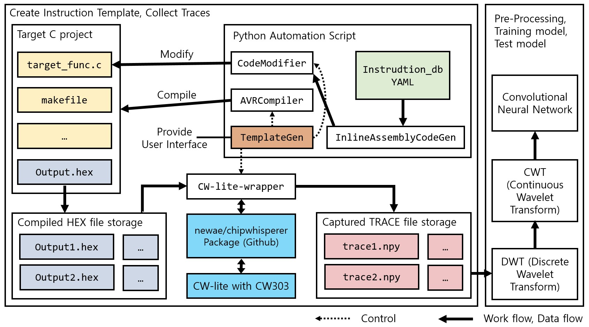

[View in English](./kor.html).

# Who is Daehyeon Bae?

Daehyeon Bae(배대현) is an undergraduate student studying information security. He is currently studying in [ACT Lab (Advanced Cryptography Technology Laboratory)](https://act.hoseo.ac.kr) at [Hoseo University](https://www.hoseo.ac.kr/).

Keywords of interest : **Cryptography**, **Side-chennal attack**, **Programming language**, **Machine Learning**, **Open source projects**, **Linux**

Contact :  noeyheadb@gmail.com

---

# Academic background

### Bachelor's degree

> I am currently taking the last semester.  

* (Scheduled) Bachelor of Science In Information Security Engineering  
* Hoseo University (2017.03 ~ 2021.02)  
  
GPA: 4.35/4.5, Major GPA: 4.46/4.5 (~2020/07, 7 semesters)

### Master's degree

> I am currently taking B.S & M.S combined course.  

* B.S & M.S combined course
* Hoseo University (2020.03 ~ 2022.02)

* * *

# Activity

## Conference

##### 한국정보보호학회 학술대회 : [KIISC](https://kiisc.or.kr/) Conference on Information Security and Cryptography (CISC)

| Date    | Paper name                                                                    | Remark |
|:--------|:----------------------------------------------------------------------------|:------|
| 2018.12 | *_**부채널 분석 공격에 대응하는 초경량 블록 암호 CHAM 구현을 위한 축소 마스킹 기법 적용**_ | second author |
| 2019.06 | 전력 분석 공격을 위한 AutoEncoder 기반의 효율적인 POI 분석 기법 연구 | lead author   |
| 2019.06 | MLP 딥러닝 기법에 기반한 전력분석 공격 구현 및 분석 | second author |
| 2019.10 | *_**중국 표준 블록 암호 알고리즘 SM4에 대한 전력 분석 공격 및 대응 기법**_ | lead author  |
| 2019.12 | 블록 암호에 대한 부채널 분석용 전력 파형 데이터 셋 구축 | lead author  |
| 2020.06 | *_**마이크로 컨트롤러 소비 전력 기반 명령어 수준 역어셈블러 구현**_ | lead author  |

###### *_**Paper**_ : Best paper award

## Paper

##### 한국정보보호학회 논문지 : Journal of The Korea Institute of Information Security and Cryptology (JKIISC)

| Date    | Paper name                                                                    | Remark |
|:--------|:----------------------------------------------------------------------------|:------|
| 2019.10 | [MLP 딥러닝 기법에 기반한 전력분석 공격 구현 및 분석](https://doi.org/10.13089/JKIISC.2019.29.5.997) | second author |
| 2020.02 | [중국 표준 블록 암호 알고리즘 SM4에 대한 전력 분석 공격 및 대응 기법](https://doi.org/10.13089/JKIISC.2020.30.1.39) | lead author  |
| 2020.08 | [마이크로 컨트롤러 소비 전력 기반 명령어 수준 역어셈블러 구현](https://doi.org/10.13089/JKIISC.2020.30.4.1) | lead author  |

## Awards

| Date    | Contest Name                          | Award         | Inst.      |
|:--------|:--------------------------------------|:--------------|:-----------|
| 2018.12 | 호서대학교 프로그래밍 경진대회           | Second place  | 호서대       |
| 2018.12 | 한국정보보호학회 동계학술대회 2018       | Best Paper    | 한국정보보호학회|
| 2019.10 | 한국정보보호학회 충청지부 학술대회 2019   | Best Paper    | 한국정보보호학회|
| 2019.10 | 2019년도 부채널 분석 경진대회            | First place   | [한국전자통신연구원](https://www.etri.re.kr)|
| 2019.12 | 호서대학교 프로그래밍 경진대회            | First place   | 호서대|
| 2020.07 | 한국정보보호학회 하계학술대회 2020        | Best Paper    | 한국정보보호학회|

## Certificate

| Date    | Certificate Name                                                             | Detail                | Inst.                           |
|:--------|:-----------------------------------------------------------------------------|:----------------------|:--------------------------------|
| 2017.09 | [리눅스 마스터](https://www.ihd.or.kr/introducesubject1.do)                   | 2급               | [KAIT](https://www.kait.or.kr)  |
| 2020.07 | [TOPCIT (Test Of Practical Competency in ICT)](https://www.topcit.or.kr/)    | Level 3               | [IITP](https://www.iitp.kr)     |
| 2020.00 | _(필기 합격)_ [~~정보보안기사~~](https://kisq.or.kr/) | 필기 합격 | [KISA](https://www.kisa.or.kr)  |

* * *

# What can I do?

* Programming Language
    * **Python**
        * The most frequently used language
        * Machine learning
        * Data analysis/visualization
        * General purpose script
    * **Java**
        * GUI Programming (JavaFX)
        * Web Server (Servlet)
        * General purpose program
    * **C/C++**
        * Implementation of cryptographic algorithm
        * Embedded programming
* Knowledge
    * **Cryptography & Cryptanalysis**
        * Cryptography
        * Side-channel attack
            * Power consumption analysis
            * cache side-channel attack
    * **Linux**
        * The overall understanding of Linux architecture
        * Familiar with Linux development environment
        * Specially familiar with Ubuntu
    * **Web vulnerability analysis**
* Tools
    * **Git/Github**
        * `git` CLI
        * Overall github's contribution process (ex. PR)
    * **Jetbrains IDEs**
        * PyCharm, IntelliJ, CLion

> In addition to the above, I have knowledge of network, computer structure, operating system, etc.

* * *

# Projects

* Implementation of Side-channel based disassembler using Deep Learning model
    * This project started with the undergraduate graduation project from March/2020.
    * Source Code will be released to Github soon. [(repository link)](https://github.com/noeyheadb/scb-disas)
    * More information : [this paper](https://doi.org/10.13089/JKIISC.2020.30.4.1)
    

[back](./)
